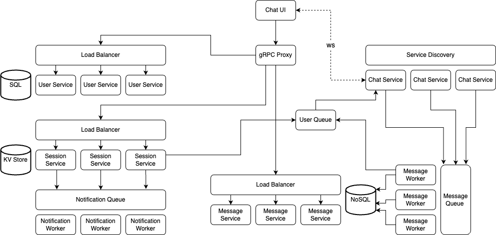
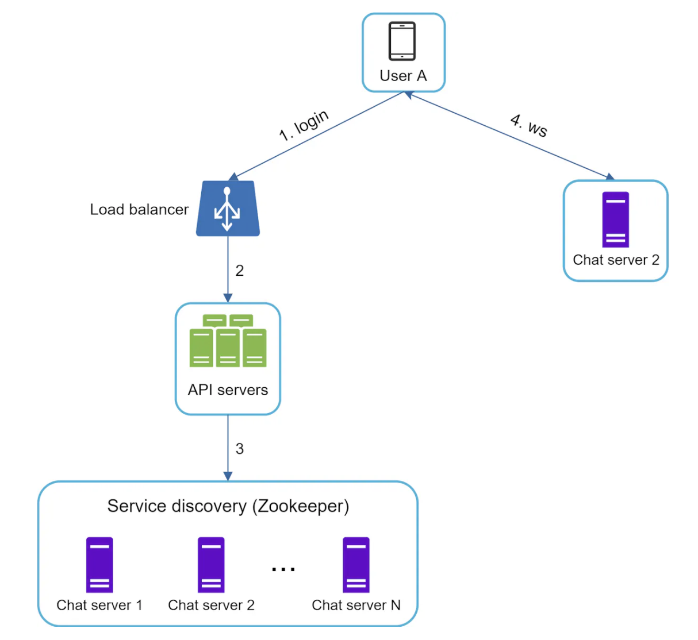

# Chat Application

## Design scope

### Functional

- Support for 1-on-1 and group chats
- Real-time chat communication
- Support for large scale daily active users (DAU)
- Online presence indicator
- Persistent storage of messages
- Push notification
- Multiple device support (assume user will be in the same geographical location)
- Support for message read receipts

### Non-functional

- Low latency
- Consistency
- High availability
- Secure with end-to-end encryption (only communicating parties have access to messages)
- Scalability

## Additional features

- Caching at client browser using IndexedDB
- Asset Service for managing static content including media, files, images, etc.
- Support for message editing

# Architecture design

## Overview



1. User authenticates with User Service
2. On successful login, User Service responds with user metadata
3. User retrieves Chat Server to connect to from the Service Discovery and establishes a websocket connection
4. Chat Server publishes regular heartbeat to the Service Discovery
5. On successful websocket connection, Chat Server will read from the User's Queue which receives current events (message, channel, etc.)
6. When a user sends a message, the Chat Server will write the message to the Message Queue and send an acknowledgement back to the user
7. Message Workers subscribing to the Message Queue will save the message in a Key-Value Data Store
8. On successful write, the message will be published to the respective recipient's queue, regardless if the user is offline/online
9. User session is stored temporarily in a Key-Value Data Store that is managed by the Session Service
10. If the recipient is offline, an event will be created and pushed to the Notification Queue, which will be subsequently read by the Notification Workers for sending push notification

## Communication

### Sending and receiving messages

As we need a globally distributed system, users will be connected to different chat servers.

For both sending and receiving messages, websocket is preferred between client and chat server as it is bi-directional and persistent.

### Others

For other features including signup, authentication, profile change, retrieval of older messages, REST over HTTP or gRPC is preferred.

## Service discovery

The primary role of service discovery is to recommend the best chat server for a client based on the criteria like geographical location, server capacity, etc. **etcd** is a popular open-source solution for service discovery. It registers all the available chat servers and picks the best chat server for a client based on predefined criteria.



1. User A tries to log in to the app
2. The load balancer sends the login request to API servers
3. After the backend authenticates the user, service discovery finds the best chat server for User A
4. User A connects to chat server 2 through WebSocket

## Databases

### Generic data

For generic data related to user identity and chat associations, a **relational** database is preferred.

### Message

For core messaging functionality, as it generates a huge volume of traffic, swift read/write operations for large data volumes is required, and **non-relational key-value** data store (Cassandra) is preferred for the following reasons:

- Key-value stores allow easy horizontal scaling
- Key-value stores provide very low latency to access data
- Relational databases do not handle long tail of data well; when the indexes grow large, random access is expensive
- Key-value stores are adopted by other proven reliable chat applications

In Cassandra, records are sharded by the partition keys. On each node, records with the same partition key are sorted by the sort key.

## Schemas

### Message

When a message is received, it will be pushed to a queue for processing. Kafka is chosen as it provides the following guarantees:

- Exactly once delivery and message ordering
- Scalability

Key features of a message:

- IDs must be unique
- IDs should be sortable by time (cannot rely on createdAt as two messages can be created at the same time)
- Each message belongs to a channel
- Channel can either refer to a group or 1-on-1 chat

For generating IDs, there are three approaches:

- Auto increment feature in SQL, but NoSQL does not provide such feature
- Use a global 64-bit sequence number
- Use local sequence number generator; this is sufficient as maintaining order within a channel is sufficient

For 1-on-1 chats, to prevent duplicated channels from being created at the same time from both users, the channelId for 1-on-1 chat is the combination of both userIds sorted in ascending order.

```json
{
  "msgId": 123546341,
  "channelId": "p6o5n4m3l2-k1j0-i9h8-g7f6-e5d4c3b2a1",
  "senderId": "5e4d3c2b-1a0p-9o8n-7m6l-5k4j3i2h1g0f9e8d7",
  "type": "message",
  "content": "Hello, how are you?",
  "messageStatus": "delivered",
  "createdAt": "2023-09-17T10:30:00.000"
}
```

### User-and-channel relationship

There are two implementations available.

For option 1, we have one table storing the channelId and userId, and the primary key is the combination of both. This is suitable for SQL. If NoSQL is used, a secondary index is not needed as it does not improve performance for high-cardinality columns in KV store (channelId-userId is unique). Otherwise, you can create secondary index on userId column.

```json
{
  "channelId": "p6o5n4m3l2-k1j0-i9h8-g7f6-e5d4c3b2a1",
  "userId": "5e4d3c2b-1a0p-9o8n-7m6l-5k4j3i2h1g0f9e8d7",
  "createdAt": "2023-09-17T10:30:00.000"
}
```

If NoSQL is chosen, option 2 is preferred where two tables are created:

- First table will use channelId as the partition key and userId as sort key; this is used for broadcasting messages from a channel
- Second table will use userId as the partition key and channelId as sort key; this is used for determining the channels a user belongs to

### User-and-chat-server relationship

Each user can be connected to multiple chat-servers if multiple devices are used. Key-value store can be used to persist this data temporarily e.g. Redis.

A heartbeat mechanism can be implemented to determine if the client is still connected to the chat server in the event of network disruption.

```json
{
  "chatServerId": "https://chatserver1.com",
  "userId": "5e4d3c2b-1a0p-9o8n-7m6l-5k4j3i2h1g0f9e8d7",
  "lastActiveTimestamp": "2023-09-17T10:30:00.000"
}
```

## Message acknowledgement

When the message is successfully pushed to the broker queue, a message acknowledgement back to the client will be sent. If the acknowledgement message does not include a messageId, the message failed to deliver.

## Message read receipts

When a user opens a channel, all unread messages will be marked as read, even if the user did not visit every message.

Instead of marking every message as read, the user's lastReadMessageId can be persisted with the channel metadata to serve as the checkpoint for determining whether messages from senders have been read.

## Channel events

Channel events can refer to user changing group name, adding/deleting new users, etc. A separate table needs to be created to store all events related to a channel.

## Message synchronization across multiple devices

Each user will have a dedicated queue of inbound messages which will act as the single source of truth for new messages. If a user has sent a message from one device, once the message has been delivered to the recipients, it will be pushed to the user's queue for confirmation.

## User-centric queue (personal inbox)

When new messages or channel events need to be delivered to a user, if the user is online, they can be pushed directly to the chat server the user is connected to. However, the downside is that the chat server can be overwhelmed with many HTTP calls, and order-of-delivery can become inconsistent.

Another alternative is to have a message queue (inbox) for each user. Users will subscribe to their own queue as the source of truth for new messages or events. Benefits include:

- Simplifies message sync flow as each client only needs to check their own inbox
- Services that need to broadcast events/messages to users are agnostic of which chat server they are connected to
- Messages/events are guaranteed to be delivered to the user in the event of transient network failures i.e. user will not miss out messages/events

However, the downsides include:

- Events and messages are duplicated in the message queue which can get expensive; however, since the queue is for storing current events, retention period can be shortened
- Older events/messages will get deleted after a certain period; users will still need to fetch data from database

## 1-on-1 chat

### Message flow

1. User A sends a message to Chat Server 1
2. Chat Server 1 receives message and generates a message ID from ID generator
3. Chat Server 1 sends message to message queue and ack message delivery back to sender
4. Message Server pulls message from queue and stores in key-value store
5. Message Server publishes message to user B's queue (personal inbox)
6. If user B is online, Message Server pushes message to Chat Server 2, which forwards message to user B via websocket
7. If user B is offline, Message Server sends push notification to user B

## Group chats

There are a few ways of handing group messages:

1. Broadcast group messages (push) to all users in the group (write amplification)
2. Client requests/pulls for the latest messages periodically (read amplification)
3. Creating a queue for each user (write diffusion)
4. Create a topic for groups greater than a certain size
5. Hybrid method where each user has a message queue for small groups, and a separate queue for each large group (recommended)

For write amplification, if the group is very large, pushing each group message will take up a tremendous amount of bandwidth.

Creating queues for each user may pose scalability problems for the message broker. However, it decouples the server from knowing which chat server the user is connected to, and simplifies message distribution. Moreover, it reduces client read from database if latest message stored on the client session is less than the duration of queue message retention period.

The main reason for handling large rooms differently is the fact that many users won't be online at any given time, hence pushing messages to their streams is a bit too much work. Instead, having a stream for each large group allows clients to pull messages. However, group sizes can change. Also, the chat server needs to subscribe to multiple topics which can be resource consuming.

## Online presence

Session servers are responsible for managing online status and broadcasting events to recipients. A key-value data store such as Redis can be used to persist data.

### User login

After a WebSocket connection is built between the client and the real-time service, user A’s online status and last_active_at timestamp are saved in the KV store. Presence indicator shows the user is online after he/she logs in.

```json
{
  "status": "online",
  "lastActiveTimestamp": "2023-09-17T10:30:00.000"
}
```

### User logout

When a user logs out, it goes through the user logout flow. The online status is changed to offline in the KV store. The presence indicator shows a user is offline.

### User disconnection

When a user disconnects from the internet, the persistent connection between the client and server is lost. A naive way to handle user disconnection is to mark the user as offline and change the status to online when the connection re-establishes. However, this approach has a major flaw. It is common for users to disconnect and reconnect to the internet frequently in a short time.

Instead, we introduce a **heartbeat mechanism** to solve this problem. Periodically, an online client sends a heartbeat event to presence servers. If presence servers receive a heartbeat event within a certain time, a user is considered as online. Otherwise, it is offline. This can be done through CRON job that checks the last active timestamp and current timestamp.

## Services

### API gateway

- Handles multiple protocols including HTTP, websocket, TCP/IP
- Includes features such as authentication, authorization, rate limiting, throttling, and API versioning

### User service

- Responsible for storing user data in relational store
- Utilizes etcd as service discovery
- Provides API for adding chat server to service registry

### Chat service

- Maintains websocket connection with client
- Real-time notifications are pushed and forwarded to websocket

### Message service

- Stores messages in NoSQL
- Maintains channel-client and client-channel relationships

### Notification service

- Provides best-effort delivery
- Message queue to store messages to be delivered as notifications
- Messages are pulled by AWS SNS which are forwarded to users

### Presence service

- Maintains all users' online status and last active timestamp in a relational data store
- Broadcasts online status to friends
- Redis as KV data store

### Asset service

- Responsible for sending and receiving media files
- The compressed and encrypted file is sent to the asset service to store the file on blob storage
- Maintains a hash for each file to avoid duplication of content on the blob storage
- Third-party AWS S3 is used

## Deployment

1. Create Docker network

```sh
$ docker network create -d bridge chatapp
```

2. Spin up Docker compose files in the following order: message-service, user-service, session-service, chat-service, chat-ui
